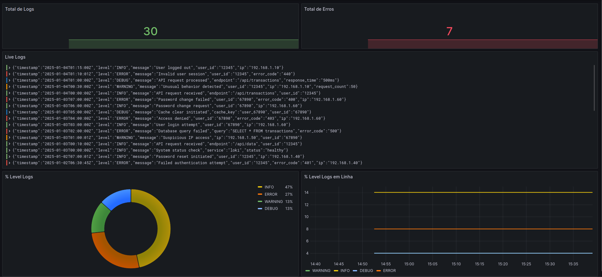

# GRAFANA E LOKI
- Aplicação de exemplo para mostrar como funcionar e como usar os logs

# CONCEITOS & FERRAMENTAS

## GRAFANA
- Grafana é uma plataforma de visualização de dados e monitoramento. É conhecida por sua flexibilidade, permitindo que os usuários criem dashboards customizados a partir de diferentes fontes de dados


## LOKI
- Loki é uma ferramenta desenvolvida pela Grafana Labs focada em centralização e consulta de logs. Ele foi projetado para ser altamente escalável e eficiente em termos de custo, inspirado no modelo do Prometheus (que coleta métricas).


## PROMTAIL
- O Promtail é uma ferramenta open-source desenvolvida pela Grafana, especializada em coletar logs de diversas fontes em seus servidores e encaminhá-los para um sistema centralizado de agregação de logs, geralmente o Grafana Loki.


<hr>


## LOGS
- Os logs são registros de atividades gerados por sistemas, aplicações ou dispositivos. Eles são essenciais para o monitoramento, depuração e auditoria de eventos, permitindo que desenvolvedores e administradores de sistemas identifiquem problemas, analisem o comportamento do sistema e garantam conformidade.


### Tipo de Logs

- Logs de Sistema
- Logs de Aplicações
- Logs de Segurança
- Logs de Rede
- Logs de Acesso
- Logs de Auditoria
- Logs de Bancos de Dados
- Logs de Containers/Orquestradores
- Logs de Performance

### Níveis de Logs
- TRACE
- DEBUG
- INFO
- WARN
- ERROR
- FATAL


Obs.: Monitoramento e Alertas (Logs de nível WARN e ERROR frequentemente disparam alertas em sistemas de monitoramento.)


## Estrutura de logs recomentada pela OWASP

```json
{
  "timestamp": "2025-01-04T15:35:00Z",
  "level": "error",
  "application": "payment-service",
  "event": "payment_failure",
  "message": "Payment failed due to insufficient funds",
  "userId": "67890",
  "transactionId": "TXN123456",
  "amount": 150.00,
  "currency": "USD",
  "traceId": "z1y2x3w4v5u6t7s8",
  "stack": "Error: InsufficientFundsException at PaymentProcessor.process (PaymentService.java:45)"
}
```


## OBS
- O Promtail lê os logs (ficheiros) de várias fontes/origens, e os envia no Loki, e o Grafana faz
a conexão com o Loki para ler esses registos e os apresenta em um dashboard, para melhor serem visualizados.


## TO INSTALL

- git clone: https://github.com/acambinza/grafana_loki.git
- cd grafana_loki
- docker-compose up -d
- APPs:
    - grafana: http://localhost:3000
    - promtail: http://localhost:9080


## Exemplo de LogQL  
- link: https://grafana.com/docs/loki/latest/query/

### NA APP

- {job="app_logs"} |= "INFO"               -> vai trazer todos dos logs que contém o info
- {job="app_logs"} != "INFO"               -> vai trazer todos dos logs excepto o info
- {job="app_logs"} |~ "INFO|ERROR"         -> vai filtrar os logs de info e de error
- {job="app_logs"} !~ "INFO|ERROR"         -> vai filtrar os logs excepto os de infor e error
- {job="app_logs"} | logfmt                -> formata os logs
